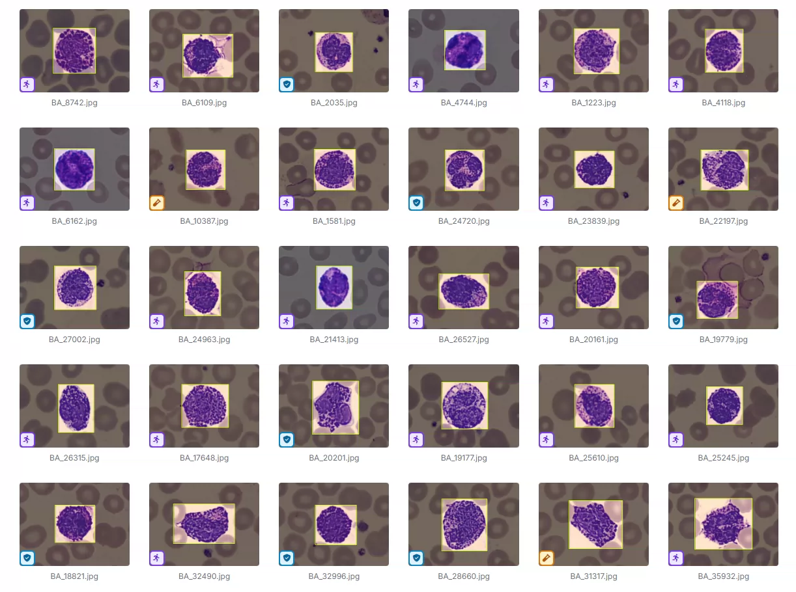
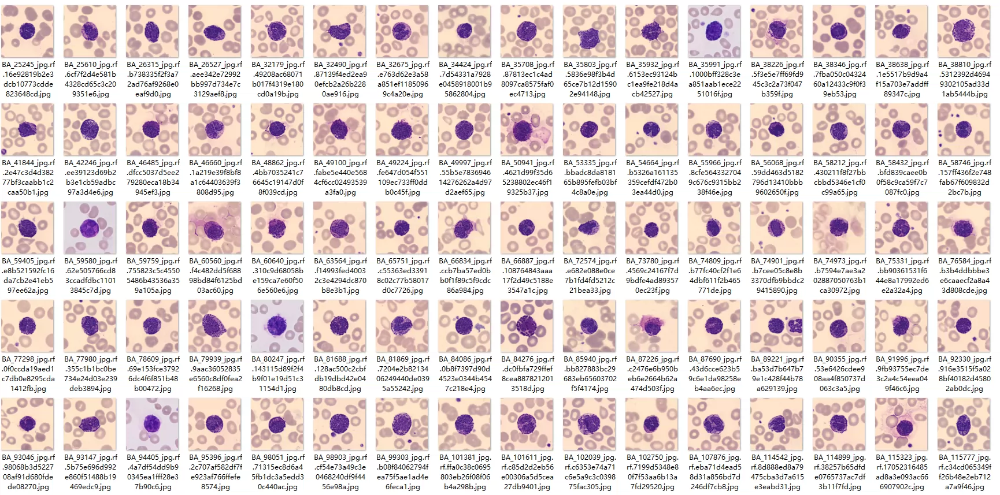
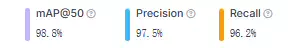
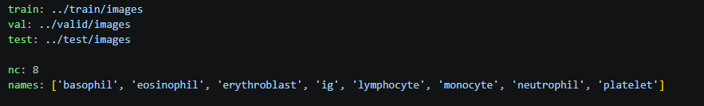
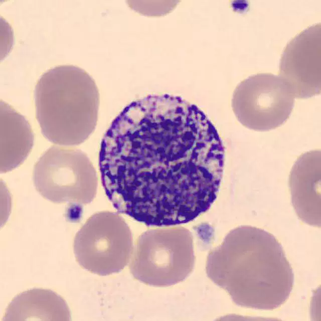
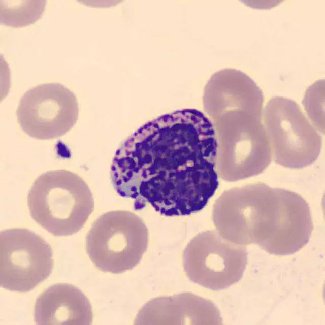
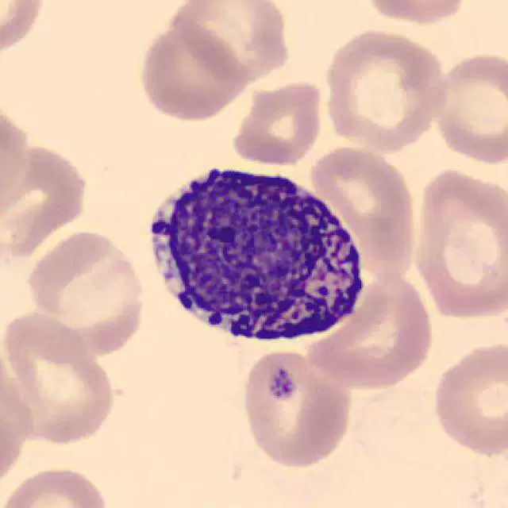
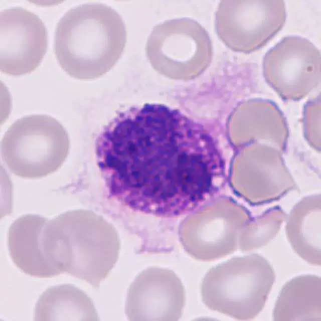

## Body

Blood Cell Detection Dataset - 8 Types, Platelets, Lymphocytes, Immunoglobulins, YOLO Format

Totaling over 8000 images, each labeled appropriately.
The dataset is divided into 8 categories: 'basophil', 'eosinophil', 'erythroblast', 'ig', 'lymphocyte', 'monocyte', 'neutrophil', 'platelet'
Serous Basophils, Eosinophils, Erythroblasts, Immunoglobulins, Lymphocytes, Monocytes, Neutrophils, Platelets

Electronic virtual products are not returnable or exchangeable.

## Images

Here is a pay link on Stripe ( https://buy.stripe.com/3cs8yP7sY87d0vu9AB ). Please contact me lonlonago@foxmail.com after funding $89, and I will send you a complete data files , thank you!

